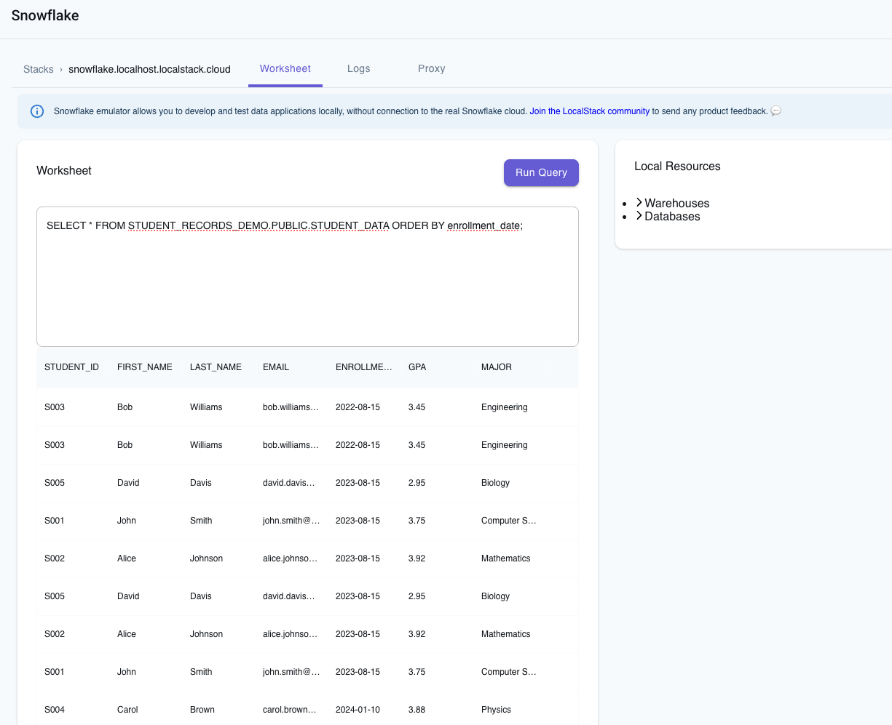



## Introduction

This guide explains how to set up the Snowflake emulator and use Snowflake CLI to interact with Snowflake resources running on your local machine. You'll learn how to create databases, tables, set up automated data ingestion using Snowpipe, and work with S3 storage - all running locally with LocalStack.

## Prerequisites

- [`localstack` CLI](https://docs.localstack.cloud/getting-started/installation/#localstack-cli)
- [LocalStack for Snowflake]()
- [`awscli-local`](https://github.com/localstack/awscli-local) for interacting with LocalStack's S3 service

LocalStack for Snowflake works with popular Snowflake integrations to run your SQL queries. This guide uses the [Snowflake CLI](), but you can also use [snowSQL](), [DBeaver]() or the [LocalStack Web Application]() for this purpose.

## Instructions

Before you begin, pull the Snowflake emulator image (`localstack/snowflake`) and start the container:


$ export LOCALSTACK_AUTH_TOKEN=<your_auth_token>
$ IMAGE_NAME=localstack/snowflake:latest localstack start


Check the emulator's availability by running:


$ curl -d '{}' snowflake.localhost.localstack.cloud:4566/session
<disable-copy>
{"success": true}
</disable-copy>


In this quickstart, we'll create a student records pipeline that demonstrates how to:

- Create databases, schemas, and tables
- Set up S3 stages for data storage
- Configure Snowpipe for automated data ingestion
- Load sample student data from CSV files

### Create database, schema & table

Create the Snowflake database named `STUDENT_RECORDS_DEMO` and use it:

```sql
CREATE DATABASE IF NOT EXISTS STUDENT_RECORDS_DEMO;
USE DATABASE STUDENT_RECORDS_DEMO;
```

The output should be:

```bash
+-----------------------------------------------------+
| status                                              |
|-----------------------------------------------------|
| Database STUDENT_RECORDS_DEMO successfully created. |
+-----------------------------------------------------+
```

Create a Snowflake schema named `PUBLIC` and use it:

```sql
CREATE SCHEMA IF NOT EXISTS PUBLIC;
USE SCHEMA PUBLIC;
```

The output should be:

```bash
+---------------------------------------------+
| result                                      |
|---------------------------------------------|
| public already exists, statement succeeded. |
+---------------------------------------------+
```

Last, create the table `STUDENT_DATA` in the database:

```sql
CREATE OR REPLACE TABLE STUDENT_DATA (
    student_id VARCHAR(50),
    first_name VARCHAR(100),
    last_name VARCHAR(100),
    email VARCHAR(200),
    enrollment_date DATE,
    gpa FLOAT,
    major VARCHAR(100)
);
```

The output should be:

```bash
+------------------------------------------+
| status                                   |
|------------------------------------------|
| Table STUDENT_DATA successfully created. |
+------------------------------------------+
```

### Create file format & stage

Now, create a file format for CSV files:

```sql
CREATE OR REPLACE FILE FORMAT csv_format
    TYPE = CSV
    FIELD_DELIMITER = ','
    SKIP_HEADER = 1
    NULL_IF = ('NULL', 'null')
    EMPTY_FIELD_AS_NULL = TRUE;
```

The output should be:

```bash
+----------------------------------------------+
| status                                       |
|----------------------------------------------|
| File format CSV_FORMAT successfully created. |
+----------------------------------------------+
```

You can then create a stage pointing to the S3 bucket:

```sql
CREATE OR REPLACE STAGE student_data_stage
    URL = 's3://student-records-local/data/'
    CREDENTIALS = (AWS_KEY_ID='test' AWS_SECRET_KEY='test')
    FILE_FORMAT = csv_format
    AWS_ROLE = NULL;
```

The output should be:

```bash
+-----------------------------------------------------+
| ?COLUMN?                                            |
|-----------------------------------------------------|
| Stage area STUDENT_DATA_STAGE successfully created. |
+-----------------------------------------------------+
```

Note that the S3 bucket is not created yet, we'll create it in the upcoming steps.

### Create Snowpipe

Create a Snowpipe for automated ingestion:

```sql
CREATE OR REPLACE PIPE student_data_pipe 
  AUTO_INGEST = TRUE
  AS
  COPY INTO STUDENT_DATA
    FROM @student_data_stage
    PATTERN='.*[.]csv'
    ON_ERROR = 'CONTINUE';
```

You can see the pipe details by running:

```sql
DESC PIPE student_data_pipe;
```

Copy the `notification_channel` value from the output, which will be used to setup the S3 bucket and event notifications.

### Create a S3 bucket

Create a S3 bucket named `student-records-local` using `awslocal`:


$ awslocal s3 mb s3://student-records-local


You can then configure the S3 bucket notification for Snowpipe using `awslocal`:


$ awslocal s3api put-bucket-notification-configuration \
    --bucket student-records-local \
    --notification-configuration '{
        "QueueConfigurations": [
            {
                "Id": "snowpipe-ingest-notification",
                "QueueArn": "arn:aws:sqs:us-east-1:000000000000:sf-snowpipe-test",
                "Events": ["s3:ObjectCreated:*"]
            }
        ]
    }'


Replace the `QueueArn` value with the `notification_channel` value from the Snowpipe details, if its different.

### Upload sample data

Create a new file named `student_data.csv` with sample student records:

```csv
student_id,first_name,last_name,email,enrollment_date,gpa,major
S001,John,Smith,john.smith@university.edu,2023-08-15,3.75,Computer Science
S002,Alice,Johnson,alice.johnson@university.edu,2023-08-15,3.92,Mathematics
S003,Bob,Williams,bob.williams@university.edu,2022-08-15,3.45,Engineering
S004,Carol,Brown,carol.brown@university.edu,2024-01-10,3.88,Physics
S005,David,Davis,david.davis@university.edu,2023-08-15,2.95,Biology
```

Upload the CSV file to the S3 bucket using `awslocal`:


$ awslocal s3 cp student_data.csv s3://student-records-local/data/


### Verify data ingestion

Now that the CSV file has been uploaded, Snowpipe should automatically ingest the data into the table. Let's verify the data was loaded successfully:

```sql
USE DATABASE STUDENT_RECORDS_DEMO;
USE SCHEMA PUBLIC;

SELECT COUNT(*) as total_students FROM STUDENT_DATA;
```

The output should be:

```bash
+----------------+
| TOTAL_STUDENTS |
|----------------|
| 5              |
+----------------+
```

Similarly, you can query the student details based on their GPA:

```sql
SELECT first_name, last_name, major, gpa FROM STUDENT_DATA WHERE gpa >= 3.8;
```

The output should be:

```bash
+---------------------------------------------+
| FIRST_NAME | LAST_NAME | MAJOR       | GPA  |
|------------+-----------+-------------+------|
| Alice      | Johnson   | Mathematics | 3.92 |
| Carol      | Brown     | Physics     | 3.88 |
| Alice      | Johnson   | Mathematics | 3.92 |
| Carol      | Brown     | Physics     | 3.88 |
+---------------------------------------------+
```

Optionally, you can also query your Snowflake resources & data using the LocalStack Web Application, that provides a **Worksheet** tab to run your SQL queries.



### Destroy the local infrastructure

To stop LocalStack and remove locally created resources, use:


$ localstack stop


LocalStack is ephemeral and doesn't persist data across restarts. It runs inside a Docker container, and once it’s stopped, all locally created resources are automatically removed. To persist the state of your LocalStack for Snowflake instance, please check out our guide on [State Management]().

## Next steps

You can now explore the following resources to learn more about the Snowflake emulator:

- [User Guide](): Learn about the Snowflake emulator's features and how to use them.
- [Tutorials](): Explore tutorials to use the Snowflake emulator for local development and testing.
- [References](): Find information about the Snowflake emulator's configuration, changelog, and function coverage.
