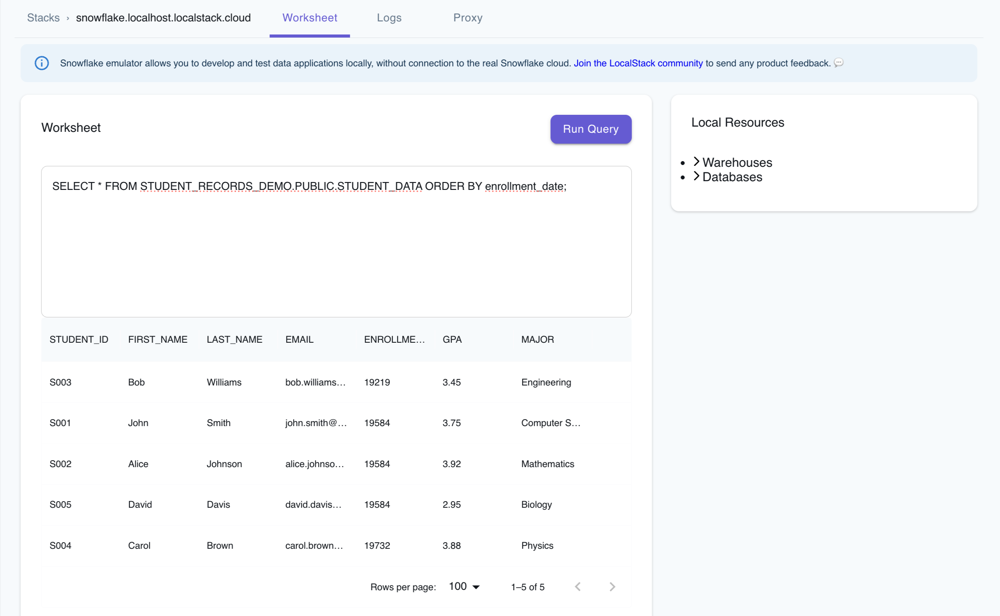



## Introduction

This guide explains how to set up the Snowflake emulator and use Snowflake CLI to interact with Snowflake resources running on your local machine. You'll learn how to create a Snowflake database, schema, and table, upload data to a stage, and load data into the table. This quickstart is designed to help you get familiar with the Snowflake emulator and its capabilities.

## Prerequisites

- [LocalStack for Snowflake]()
- [`localstack` CLI](https://docs.localstack.cloud/getting-started/installation/#localstack-cli)
- [Snowflake CLI]()

LocalStack for Snowflake works with popular Snowflake integrations to run your SQL queries. This guide uses the [Snowflake CLI](), but you can also use [SnowSQL](), [DBeaver]() or the [LocalStack Web Application]() for this purpose.

## Instructions

Before you begin, pull the Snowflake emulator image (`localstack/snowflake`) and start the container:


$ export LOCALSTACK_AUTH_TOKEN=<your_auth_token>
$ localstack start --stack snowflake


Check the emulator's availability by running:


$ curl -d '{}' snowflake.localhost.localstack.cloud:4566/session
<disable-copy>
{"success": true}
</disable-copy>


In this quickstart, we'll create a student records database that demonstrates how to:

- Create databases, schemas, and tables
- Create stages and upload data using the PUT command
- Load data from CSV files into tables
- Query your data

### Create database, schema & table

Create the Snowflake database named `STUDENT_RECORDS_DEMO` and use it:

```sql
CREATE DATABASE IF NOT EXISTS STUDENT_RECORDS_DEMO;
USE DATABASE STUDENT_RECORDS_DEMO;
```

The output should be:

```bash
+-----------------------------------------------------+
| status                                              |
|-----------------------------------------------------|
| Database STUDENT_RECORDS_DEMO successfully created. |
+-----------------------------------------------------+
```

Create a Snowflake schema named `PUBLIC` and use it:

```sql
CREATE SCHEMA IF NOT EXISTS PUBLIC;
USE SCHEMA PUBLIC;
```

The output should be:

```bash
+---------------------------------------------+
| result                                      |
|---------------------------------------------|
| public already exists, statement succeeded. |
+---------------------------------------------+
```

Last, create the table `STUDENT_DATA` in the database:

```sql
CREATE OR REPLACE TABLE STUDENT_DATA (
    student_id VARCHAR(50),
    first_name VARCHAR(100),
    last_name VARCHAR(100),
    email VARCHAR(200),
    enrollment_date DATE,
    gpa FLOAT,
    major VARCHAR(100)
);
```

The output should be:

```bash
+------------------------------------------+
| status                                   |
|------------------------------------------|
| Table STUDENT_DATA successfully created. |
+------------------------------------------+
```

### Create file format & stage

Now, create a file format for CSV files:

```sql
CREATE OR REPLACE FILE FORMAT csv_format
    TYPE = CSV
    FIELD_DELIMITER = ','
    SKIP_HEADER = 1
    NULL_IF = ('NULL', 'null')
    EMPTY_FIELD_AS_NULL = TRUE;
```

The output should be:

```bash
+----------------------------------------------+
| status                                       |
|----------------------------------------------|
| File format CSV_FORMAT successfully created. |
+----------------------------------------------+
```

Create a stage for uploading files:

```sql
CREATE OR REPLACE STAGE student_data_stage
    FILE_FORMAT = csv_format;
```

The output should be:

```bash
+-----------------------------------------------------+
| ?COLUMN?                                            |
|-----------------------------------------------------|
| Stage area STUDENT_DATA_STAGE successfully created. |
+-----------------------------------------------------+
```

### Upload and load sample data

Create a new file named `student_data.csv` with sample student records:

```csv
student_id,first_name,last_name,email,enrollment_date,gpa,major
S001,John,Smith,john.smith@university.edu,2023-08-15,3.75,Computer Science
S002,Alice,Johnson,alice.johnson@university.edu,2023-08-15,3.92,Mathematics
S003,Bob,Williams,bob.williams@university.edu,2022-08-15,3.45,Engineering
S004,Carol,Brown,carol.brown@university.edu,2024-01-10,3.88,Physics
S005,David,Davis,david.davis@university.edu,2023-08-15,2.95,Biology
```

Upload the CSV file to the stage using the PUT command:

```sql
PUT file://student_data.csv @student_data_stage AUTO_COMPRESS=TRUE;
```


Adjust the file path to the location of your `student_data.csv` file.


The output should show the file upload status:

```bash
source          |target             |source_size|target_size|source_compression|target_compression|status  |message|
----------------+-------------------+-----------+-----------+------------------+------------------+--------+-------+
student_data.csv|student_data.csv.gz|        425|        262|NONE              |GZIP              |UPLOADED|       |
```

Now load the data from the stage into the table:

```sql
COPY INTO STUDENT_DATA
FROM @student_data_stage
ON_ERROR = 'CONTINUE';
```

### Verify data loading

```sql
USE DATABASE STUDENT_RECORDS_DEMO;
USE SCHEMA PUBLIC;

SELECT COUNT(*) as total_students FROM STUDENT_DATA;
```

The output should be:

```bash
+----------------+
| TOTAL_STUDENTS |
|----------------|
| 5              |
+----------------+
```

Similarly, you can query the student details based on their GPA:

```sql
SELECT first_name, last_name, major, gpa 
FROM STUDENT_DATA 
WHERE gpa >= 3.8
ORDER BY gpa DESC;
```

The output should be:

```bash
FIRST_NAME|LAST_NAME|MAJOR      |GPA |
----------+---------+-----------+----+
Alice     |Johnson  |Mathematics|3.92|
Carol     |Brown    |Physics    |3.88|
```

Optionally, you can also query your Snowflake resources & data using the LocalStack Web Application, that provides a **Worksheet** tab to run your SQL queries.



### Destroy the local infrastructure

To stop LocalStack and remove locally created resources, use:


$ localstack stop


LocalStack is ephemeral and doesn't persist data across restarts. It runs inside a Docker container, and once it's stopped, all locally created resources are automatically removed. To persist the state of your LocalStack for Snowflake instance, please check out our guide on [State Management]().

## Next Steps

Now that you've completed the quickstart, here are some additional features you can explore:

- **Load data from cloud storage**: You can load data through our [Storage Integrations]() (currently supporting AWS S3) or using a script (see [Snowflake Drivers]())
- **Automate data ingestion**: You can configure [Snowpipe]() for automated data ingestion from external sources
- **Use your favorite tools**: You can continue to work with your favorite tools to develop on LocalStack for Snowflake locally, see [Integrations]()

## Further Reading

You can now explore the following resources to learn more about the Snowflake emulator:

- [User Guide](): Learn about the Snowflake emulator's features and how to use them.
- [Tutorials](): Explore tutorials to use the Snowflake emulator for local development and testing.
- [References](): Find information about the Snowflake emulator's configuration, changelog, and function coverage.
