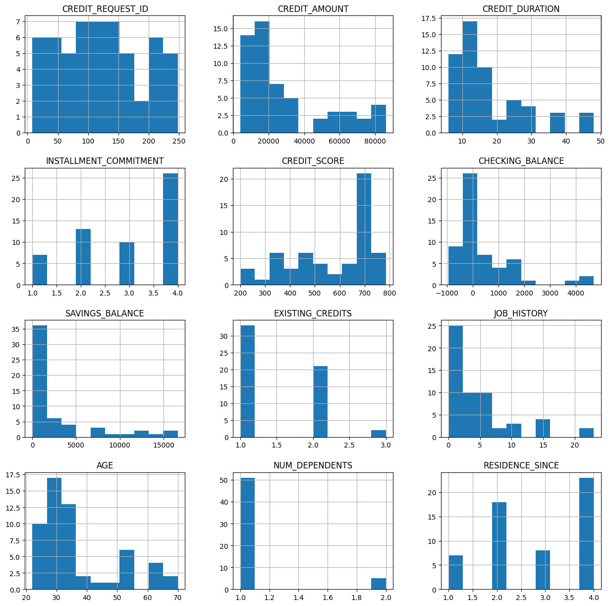
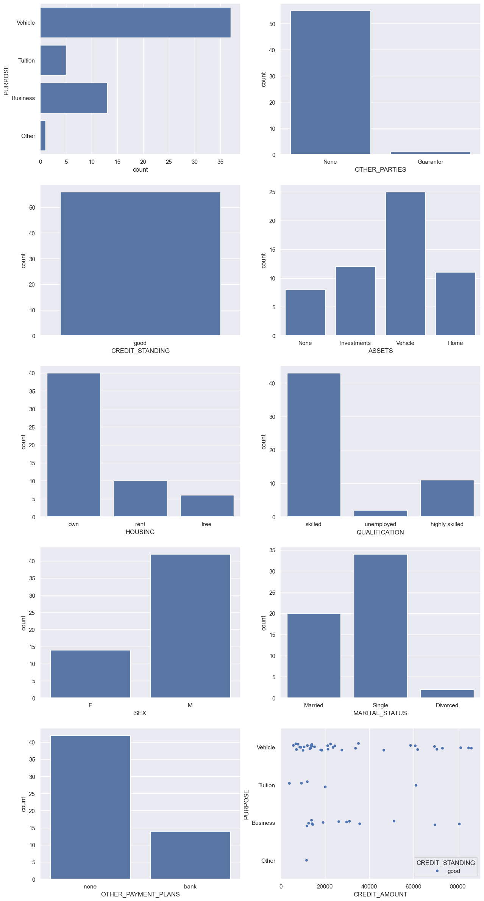

## Introduction

In this tutorial, you will learn how you can use the Snowflake emulator with Snowpark for Python and your favorite Python libraries for data analysis.

The Jupyter Notebook and the dataset used in this tutorial are available on [GitHub](https://github.com/localstack-samples/localstack-snowflake-samples/tree/main/credit-scoring-with-snowpark).

## Prerequisites

- [`localstack` CLI](https://docs.localstack.cloud/getting-started/installation/#localstack-cli) with a [`LOCALSTACK_AUTH_TOKEN`](https://docs.localstack.cloud/getting-started/auth-token/)
- [LocalStack for Snowflake]()
- [Snowpark]() with other Python libraries
- [Jupyter Notebook](https://jupyter.org/install#jupyter-notebook)

You should also download [`credit_files.csv`](https://github.com/localstack-samples/localstack-snowflake-samples/blob/main/credit-scoring-with-snowpark/credit_files.csv) and [`credit_request.csv`](https://github.com/localstack-samples/localstack-snowflake-samples/blob/main/credit-scoring-with-snowpark/credit_request.csv) files from the LocalStack repository. The files should be present in the same directory as your Jupyter Notebook.

## Start the Snowflake emulator

Start your LocalStack container in your preferred terminal/shell.


$ export LOCALSTACK_AUTH_TOKEN=<your_auth_token>
$ localstack start


Check the emulator's availability by running:


$ localstack extensions list
<disable-copy>
┏━━━━━━━━━━━━━━━━━━━━━━━━━━━━━━┳━━━━━━━━━━━━━━━━━━━━━━━━━━━━━━━┳━━━━━━━━━┳━━━━━━━━━━━━┳━━━━━━━━━━━━━┓
┃ Name                         ┃ Summary                       ┃ Version ┃ Author     ┃ Plugin name ┃
┡━━━━━━━━━━━━━━━━━━━━━━━━━━━━━━╇━━━━━━━━━━━━━━━━━━━━━━━━━━━━━━━╇━━━━━━━━━╇━━━━━━━━━━━━╇━━━━━━━━━━━━━┩
│ localstack-extension-snowfl… │ LocalStack Extension:         │ 0.1.22  │ LocalStack │ snowflake   │
│                              │ Snowflake                     │         │            │             │
└──────────────────────────────┴───────────────────────────────┴─────────┴────────────┴─────────────┘
</disable-copy>


## Create a Snowpark session

The next step is to configure the Snowflake emulator. The Snowflake emulator runs on `snowflake.localhost.localstack.cloud`. You can use the Snowpark to connect to the locally running Snowflake server.

Start Jupyter Notebook and create a new notebook. Add the following code to connect to the Snowflake emulator:

```python
from snowflake.snowpark import *
from snowflake.snowpark.functions import *

connection_parameters = {
    "user": "test",
    "password": "test",
    "account": "test",
    "warehouse": "test",
    "host": "snowflake.localhost.localstack.cloud",
}

session = Session.builder.configs(connection_parameters).create()
```

In the above configuration, you can set  `user`,  `password`,  `account`, and  `warehouse`  as  `test`  to avoid passing any production values. You can now run Snowflake SQL queries on your local machine.

```python
session.sql("create or replace database credit_bank").collect()
session.sql("use schema credit_bank.public").collect()
print(session.sql("select current_warehouse(), current_database(), current_schema(), current_user(), current_role()").collect())
```

The following output is displayed:

```bash 
[Row(?COLUMN?='TEST', CURRENT_DATABASE='CREDIT_BANK', CURRENT_SCHEMA='public', ?COLUMN?='TEST', GET_CURRENT_ROLE='PUBLIC')]
```

## Create the tables

You can now create two tables associated with this tutorial:

-   `CREDIT_FILES`: This table contains the credit on files along with the credit standing whether the loan is being repaid or if there are actual issues with reimbursing the credit.
-   `CREDIT_REQUESTS`: This table contains the new credit requests that the bank needs to provide approval on.

Run the following code to create the `credit_df` table:

```python
import pandas as pd
credit_files = pd.read_csv('credit_files.csv')
session.write_pandas(credit_files,"CREDIT_FILES",auto_create_table='True')
credit_df = session.table("CREDIT_FILES")
credit_df.schema
```

The following output is displayed:

```bash
StructType([StructField('CREDIT_REQUEST_ID', LongType(), nullable=True), StructField('CREDIT_AMOUNT', LongType(), nullable=True), StructField('CREDIT_DURATION', LongType(), nullable=True), StructField('PURPOSE', StringType(), nullable=True), StructField('INSTALLMENT_COMMITMENT', LongType(), nullable=True), StructField('OTHER_PARTIES', StringType(), nullable=True), StructField('CREDIT_STANDING', StringType(), nullable=True), StructField('CREDIT_SCORE', LongType(), nullable=True), StructField('CHECKING_BALANCE', LongType(), nullable=True), StructField('SAVINGS_BALANCE', LongType(), nullable=True), StructField('EXISTING_CREDITS', LongType(), nullable=True), StructField('ASSETS', StringType(), nullable=True), StructField('HOUSING', StringType(), nullable=True), StructField('QUALIFICATION', StringType(), nullable=True), StructField('JOB_HISTORY', LongType(), nullable=True), StructField('AGE', LongType(), nullable=True), StructField('SEX', StringType(), nullable=True), StructField('MARITAL_STATUS', StringType(), nullable=True), StructField('NUM_DEPENDENTS', LongType(), nullable=True), StructField('RESIDENCE_SINCE', LongType(), nullable=True), StructField('OTHER_PAYMENT_PLANS', StringType(), nullable=True)])
```

In a similar fashion, you can create the `credit_req_df` table:

```python
credit_requests = pd.read_csv('credit_request.csv')
session.write_pandas(credit_requests,"CREDIT_REQUESTS",auto_create_table='True')
credit_req_df = session.table("CREDIT_REQUESTS")
credit_req_df.schema
```

The following output is displayed:

```bash
StructType([StructField('CREDIT_REQUEST_ID', LongType(), nullable=True), StructField('CREDIT_AMOUNT', LongType(), nullable=True), StructField('CREDIT_DURATION', LongType(), nullable=True), StructField('PURPOSE', StringType(), nullable=True), StructField('INSTALLMENT_COMMITMENT', LongType(), nullable=True), StructField('OTHER_PARTIES', StringType(), nullable=True), StructField('CREDIT_SCORE', LongType(), nullable=True), StructField('CHECKING_BALANCE', LongType(), nullable=True), StructField('SAVINGS_BALANCE', LongType(), nullable=True), StructField('EXISTING_CREDITS', LongType(), nullable=True), StructField('ASSETS', StringType(), nullable=True), StructField('HOUSING', StringType(), nullable=True), StructField('QUALIFICATION', StringType(), nullable=True), StructField('JOB_HISTORY', LongType(), nullable=True), StructField('AGE', LongType(), nullable=True), StructField('SEX', StringType(), nullable=True), StructField('MARITAL_STATUS', StringType(), nullable=True), StructField('NUM_DEPENDENTS', LongType(), nullable=True), StructField('RESIDENCE_SINCE', LongType(), nullable=True), StructField('OTHER_PAYMENT_PLANS', StringType(), nullable=True)])
```

## Analyze the data

You can now analyze the data using Snowpark and your favorite Python libraries. For example, you can fetch the first 5 rows of the `credit_df` table:

```python
credit_df.toPandas().head()
```

You can similarly fetch the first 5 rows of the `credit_req_df` table:

```python
credit_req_df.toPandas().head()
```

You can also visualize the numeric features and categorical features. For example, you can visualize the histogram of the `credit_df` table:

```python
credit_df.toPandas().hist(figsize=(15,15))
```

The following output is displayed:
<br><br>


<br><br>

You can also visualize the categorical features of the `credit_df` table:

```python
import matplotlib.pyplot as plt
import seaborn as sns

sns.set(style="darkgrid")

fig, axs = plt.subplots(5, 2, figsize=(15, 30))
df = credit_df.toPandas()
sns.countplot(data=df, y="PURPOSE", ax=axs[0,0])
sns.countplot(data=df, x="OTHER_PARTIES", ax=axs[0,1])
sns.countplot(data=df, x="CREDIT_STANDING", ax=axs[1,0])
sns.countplot(data=df, x="ASSETS", ax=axs[1,1])
sns.countplot(data=df, x="HOUSING", ax=axs[2,0])
sns.countplot(data=df, x="QUALIFICATION", ax=axs[2,1])
sns.countplot(data=df, x="SEX", ax=axs[3,0])
sns.countplot(data=df, x="MARITAL_STATUS", ax=axs[3,1])
sns.countplot(data=df, x="OTHER_PAYMENT_PLANS", ax=axs[4,0])
sns.stripplot(y="PURPOSE", x="CREDIT_AMOUNT", data=df, hue='CREDIT_STANDING', jitter=True, ax=axs[4,1])
plt.show()
```

The following output is displayed:
<br><br>



## Conclusion

You can now perform further experimentations with the Snowflake emulator. For example, you can use the Snowpark API to run queries to get various insights, such as determining the range of loans per different category.
