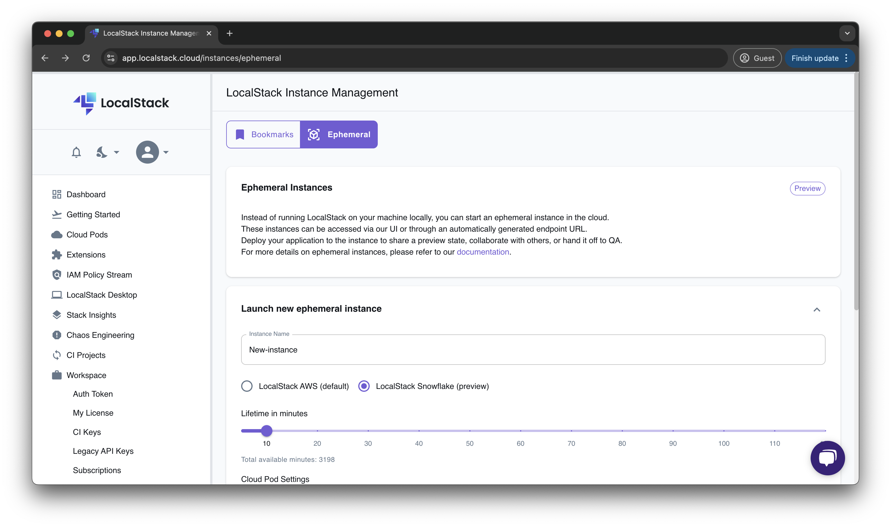



## Introduction

Ephemeral Instances allows you to run a LocalStack for Snowflake instance in the cloud. You can interact with these instances by configuring your Snowflake host with the endpoint URL of the ephemeral instance.


Ephemeral Instances is offered as a **preview** feature and under active development.


## Getting started

Navigate to the [LocalStack Ephemeral Instance Management](https://app.localstack.cloud/instances/ephemeral) page. In the form, enter the name of the new Ephemeral Instance, choose **LocalStack Snowflake (preview)**, select the lifetime of the instance by dragging the slider, and click on **Launch**.

After the ephemeral instance is created, you can run the following command to verify the status of the instance:


$ export SNOWFLAKE_HOST=<ephemeral-instance-endpoint>
$ curl -d '{}' $SNOWFLAKE_HOST/session


You can access the Ephemeral Instance via the SnowSQL or any alternative SQL client by configuring the Snowflake host with the endpoint URL of the Ephemeral Instance.
