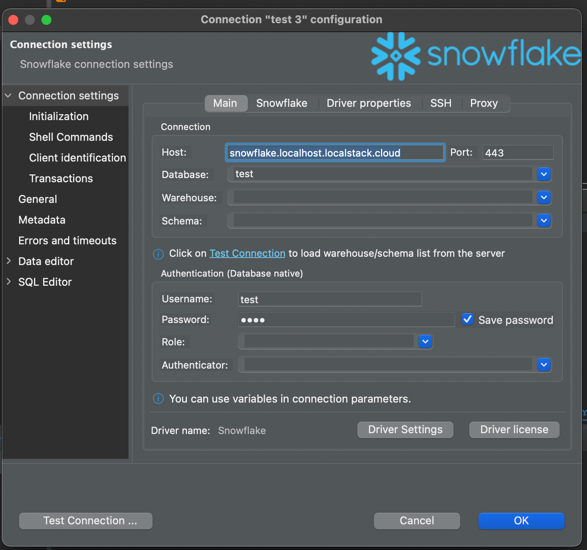

## Introduction

[DBeaver](https://dbeaver.io/) is a free and open-source universal database tool for developers, database administrators, and analysts. DBeaver provides a wide range of features, such as executing SQL statements, viewing and editing data, managing database objects, and more.

LocalStack Snowflake emulator supports DBeaver, allowing you to interact with the Snowflake emulator using the same commands and syntax as the Snowflake service. You can use DBeaver to connect to the Snowflake emulator, execute SQL commands, and manage Snowflake resources locally, such as databases, schemas, tables, stages, and more.

## Configuring SnowSQL

In this guide, you will learn how to configure DBeaver to interact with the LocalStack Snowflake emulator.

### Install DBeaver

To install DBeaver, follow the instructions in the [official DBeaver documentation](https://dbeaver.io/download/).

### Create a new connection

To create a new connection in DBeaver, follow these steps:

-   Open DBeaver. Go to the top menu, select **Database**, and choose **New Database Connection**. In the **Connect to database** window, pick **All** databases and search for **Snowflake**, then click **Next**.
-   In the **Connect to database** window, switch to the **Main** tab. Enter your Snowflake user details: 
    - **Host**: `snowflake.localhost.localstack.cloud`
    - **Database**: `test`
    - **Warehouse**: `test`
    - **Schema**: `test`
    - **User**: `test`
    - **Password**: `test`
    
      

- Click **Test Connection**.
-   If the connection test succeeds, click **Finish**. The Snowflake database will appear in DBeaver's Database Navigator. 

You can verify the connection by running a query to check the Snowflake version: `SELECT CURRENT_VERSION();`
