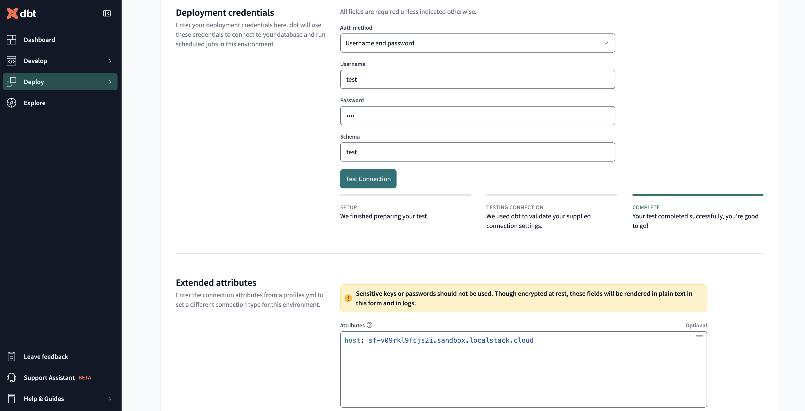

## Introduction

[dbt (data build tool)](https://www.getdbt.com/) is a transformation workflow tool that enables data analysts and engineers to transform data in their warehouses by writing modular SQL. dbt handles version control, documentation, and modularity for data transformations.

The Snowflake emulator supports dbt, allowing you to develop and test your dbt models locally without connecting to a production Snowflake instance.

## Configuring dbt

In this guide, you will learn how to configure dbt to interact with the Snowflake emulator.

### Install dbt

First, install dbt with the Snowflake adapter:


$ pip install dbt-snowflake


### Configure dbt Profile

Create or modify your `profiles.yml` file (typically located in `~/.dbt/profiles.yml`) to include the connection details for the Snowflake emulator:

```yaml
localstack_snowflake:
  outputs:
    dev:
      account: localstack
      host: snowflake.localhost.localstack.cloud
      port: 4566
      database: test
      password: test
      role: test
      schema: public
      threads: 1
      type: snowflake
      user: test
      warehouse: test
  target: dev
```

### Test the Connection

To verify your dbt configuration is working correctly with the Snowflake emulator, run:


$ dbt debug --profile localstack_snowflake


You should see output indicating a successful connection to the Snowflake emulator.

### Running dbt Commands

Once configured, you can run standard dbt commands against the Snowflake emulator.

### Example dbt Model

Here's a simple example of a dbt model which creates a table with a single row that you can use to test the integration:

```sql
-- models/example_model.sql
{{ config(materialized='table') }}

SELECT 
    1 as id,
    'test' as name
```

### Example Tests

You can test your models using dbt's generic tests.

Add the following to your `models/schema.yml`:

```yaml
version: 2

models:
  - name: example_model
    description: "A simple example model with generic tests"
    columns:
      - name: id
        description: "The primary key for this table"
        tests:
          - unique
          - not_null
      - name: name
        description: "The name field"
        tests:
          - not_null
```


# Run all models
$ dbt run --profile localstack_snowflake

# Run tests
$ dbt test --profile localstack_snowflake



### Project Structure

A typical dbt project structure when working with the Snowflake emulator might look like this:

```
my_dbt_project/
├── dbt_project.yml
├── models/
│   ├── example_model.sql
│   └── schema.yml
└── README.md
```

Example `dbt_project.yml`:

```yaml
name: 'my_dbt_project'
version: '1.0.0'
config-version: 2

profile: 'localstack_snowflake'

model-paths: ["models"]
test-paths: ["tests"]
analysis-paths: ["analyses"]
macro-paths: ["macros"]

target-path: "target"
clean-targets:
    - "target"
    - "dbt_packages"

models:
  my_dbt_project:
    materialized: table
```

### Connect to dbt Cloud

To use dbt Cloud with the Snowflake emulator, you'll first need to configure an ephemeral instance. Ephemeral instances provide isolated environments for testing and development. For more information, see the [Ephemeral Instances documentation]().

1. First, create an ephemeral instance for Snowflake in the LocalStack Web application.

2. Once your ephemeral instance is running, note the host URL (e.g., `sf-v09rkl9fcjs21.sandbox.localstack.cloud`).

3. In the dbt Cloud interface:
   - Navigate to **Deploy** > **Environments**
   - Create a new environment or edit an existing one
   - Under **Connection Settings**, select **Snowflake**
   - Fill in the basic credentials:
     * Username: `test`
     * Password: `test`
     * Schema: `public`

4. In the **Extended attributes** section, specify the host from your ephemeral instance:

```yaml
host: sf-v09rkl9fcjs21.sandbox.localstack.cloud
```




The host value must match your ephemeral instance URL. This overrides the default Snowflake host and directs connections to your LocalStack environment.


## Best Practices

1. **Version Control**: Keep your dbt models and configurations in version control
2. **Testing**: Write tests for your models to ensure data quality
3. **Documentation**: Document your models using dbt's built-in documentation features
4. **Modularity**: Break down complex transformations into smaller, reusable models


It's a good practice to always test your dbt models locally with the Snowflake emulator before deploying to production to save time and resources.
 