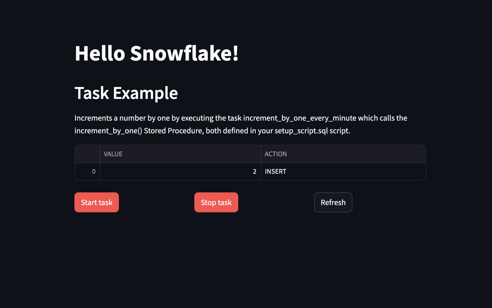

## Introduction

Snowflake Native Apps are applications built and executed directly within the Snowflake Data Cloud platform. These apps can be used to extend the capabilities of Snowflake by integrating with external services, automating workflows, and building custom data applications. These apps are developed using Snowflake-native tools (e.g., Snowflake SQL, Snowflake API, and JavaScript) and can be distributed on the Snowflake Marketplace.

The Snowflake emulator supports creating & deploying Native Apps locally with the same statements as the Snowflake service. The following operations are supported:

- [`CREATE APPLICATIONS`](https://docs.snowflake.com/en/sql-reference/sql/create-application.html)
- [`SHOW APPLICATION PACKAGES`](https://docs.snowflake.com/en/sql-reference/sql/show-application-packages.html)
- [`ALTER APPLICATION PACKAGE`](https://docs.snowflake.com/en/sql-reference/sql/alter-application-package.html)
- [`DESCRIBE APPLICATION`]( https://docs.snowflake.com/en/sql-reference/sql/desc-application)
- [`DROP APPLICATION PACKAGE`](https://docs.snowflake.com/en/sql-reference/sql/drop-application-package.html)

## Getting started

This guide is designed for users new to Native Apps and assumes basic knowledge of Snow CLI and Snowflake. Start your Snowflake emulator and connect to it using the Snow CLI in order to execute the commands further below.

In this guide, you will locally deploy a Native App using an existing Application Package.

### Clone the repository

Clone the [Native Apps repository](https://github.com/localstack/native-apps) and navigate to the `examples/snowflake` directory:

```bash
git clone https://github.com/snowflakedb/native-apps-examples.git
cd native-apps-examples/tasks-streams
```

### Deploy Native App

Deploy the Native App using the Snow CLI:

```bash
snow app run --connection localstack
```

The following output should be displayed:

```bash
Creating new application package tasks_streams_app_pkg_username in account.
Checking if stage tasks_streams_app_pkg_username.app_src.stage exists, or creating a new one if none exists.
Performing a diff between the Snowflake stage: stage and your local deploy_root: /Users/username/code/localstack/native-apps-examples/tasks-streams/output/deploy.
Local changes to be deployed:
  added:    app/manifest.yml -> manifest.yml
  added:    app/setup_script.sql -> setup_script.sql
  added:    src/module-ui/src/environment.yml -> streamlit/environment.yml
  added:    src/module-ui/src/ui.py -> streamlit/ui.py
Updating the Snowflake stage from your local /Users/username/code/localstack/native-apps-examples/tasks-streams/output/deploy directory.
Validating Snowflake Native App setup script.
Creating new application object tasks_streams_app_username in account.
Application 'TASKS_STREAMS_APP_username' created successfully.

Your application object (tasks_streams_app_username) is now available:
https://app.snowflake.com/test/test/#/apps/application/TASKS_STREAMS_APP_username
```

### Access Native App

You can access the Native App by visiting your preferred browser and navigating to the following URL:

```bash
https://snowflake.localhost.localstack.cloud:4566/apps/test/test/TASKS_STREAMS_APP_username/
```


The URL above is an example. Change the outputted URL by:

1.  Replacing `https://app.snowflake.com` with `https://snowflake.localhost.localstack.cloud:4566`.
2.  Changing the path structure from `/#/apps/application/` to `/apps/test/test/`.

You can make additional changes depending on your local setup.


The following app should be displayed:


<br><br>
