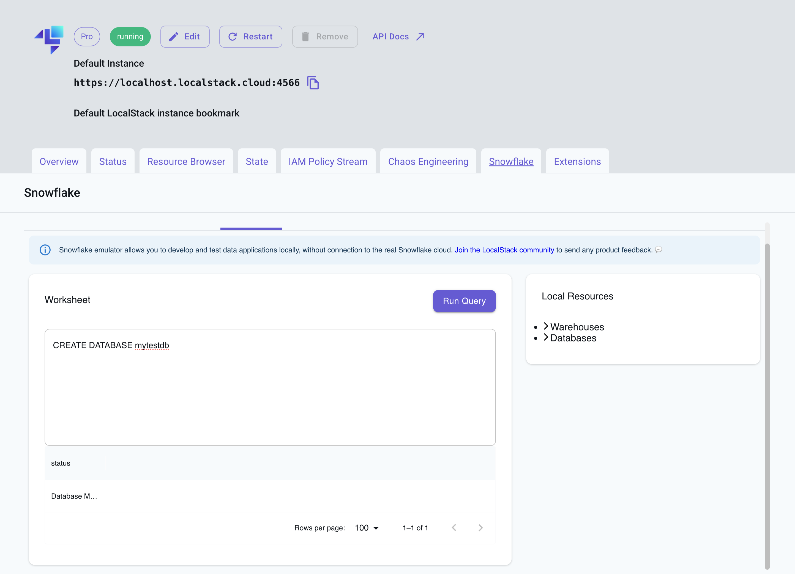
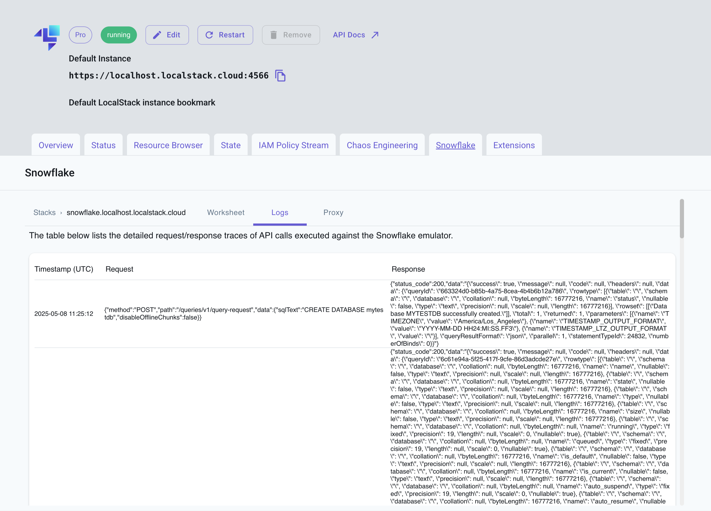
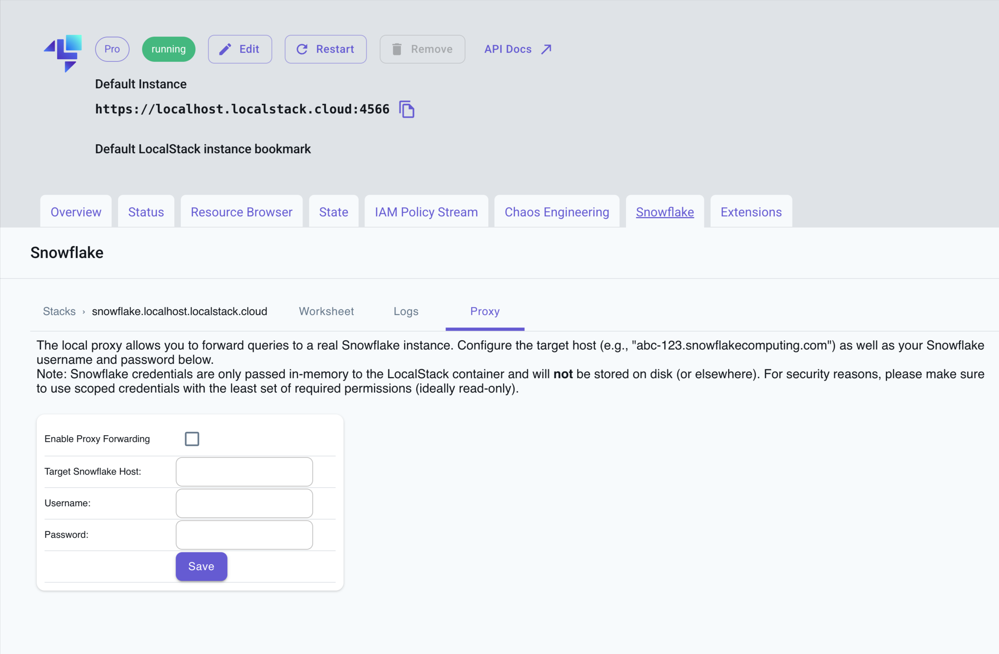



## Introduction

The Snowflake emulator provides a User Interface (UI) via the [LocalStack Web Application](https://app.localstack.cloud/). The User Interface allows you to:

* Run SQL queries and view results using a Query Editor.
* View detailed request/response traces of API calls.
* Forward queries to a real Snowflake instance using a proxy.

To access the User Interface, you need to start the Snowflake emulator and access the **Snowflake** tab in your default instance of the LocalStack Web Application. This User Interface is available only when the Snowflake emulator is running. Please note that it does not connect to the real Snowflake cloud environment (except during a proxy connection) or any other external service on the Internet.


Please note that the Snowflake User Interface is still experimental and under active development.


## Getting started

This guide is designed for users new to the Snowflake emulator Web UI. Start your Snowflake emulator using the following command:

```bash
IMAGE_NAME=localstack/snowflake localstack start
```

Navigate to [**https://app.localstack.cloud/inst/default/snowflake**](https://app.localstack.cloud/inst/default/snowflake) to access the User Interface.

### Run SQL queries

The User Interface provides a **Worksheet** tab that allows you to run SQL queries and view the results.


<br><br>

You can click on **Warehouses** and **Databases** on the right side of the worksheet to view the available warehouses and databases.

### View Snowflake logs

The User Interface provides a **Logs** tab that provides you a detailed view of request/response traces of API calls issued against the local emulator. You can view the request and response headers, body, and status code.



### Proxy to a real Snowflake instance

You can forward queries from the Snowflake emulator to a real Snowflake instance using a proxy.

The User Interface provides a **Proxy** tab that allows you to enter your Snowflake account credentials. Click on the **Save** button to save the credentials. You can now run queries in the Query Editor, and they will be forwarded to the real Snowflake instance.


Be careful when operating the proxy, as it can incur costs and access data in your real Snowflake account. For security reasons, please make sure to use scoped credentials with the least set of required permissions (ideally read-only). Only run the proxy against test/staging environments, and never against a production database.



