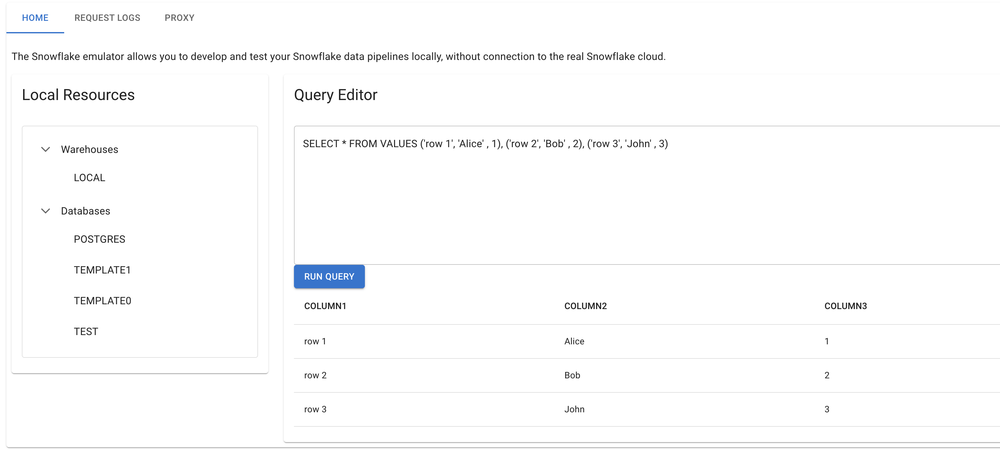
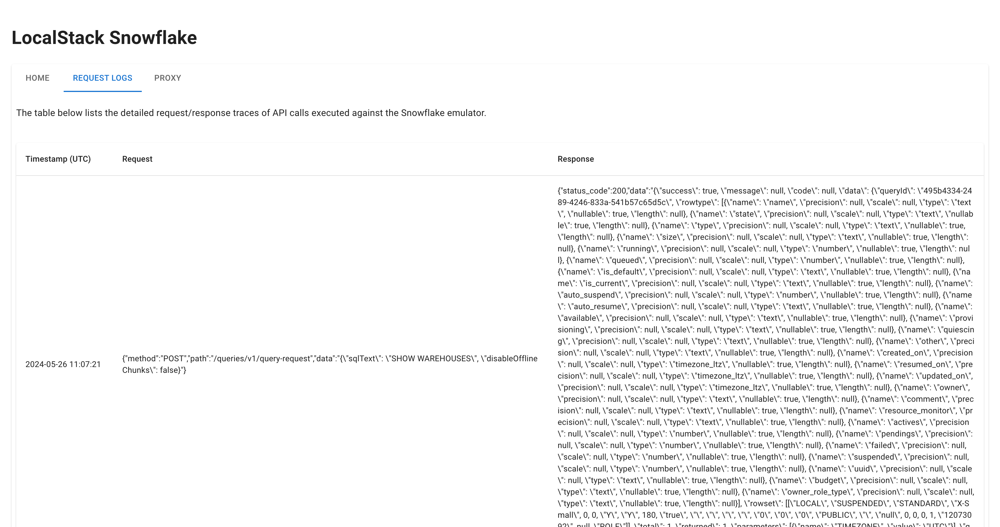
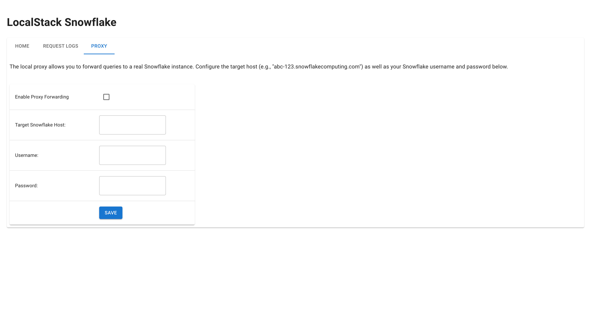

## Introduction

The Snowflake emulator provides a simple web user interface (UI) accessible via a web browser. The Web UI allows you to:

* Run SQL queries and view results using a Query Editor.
* View detailed request/response traces of API calls.
* Forward queries to a real Snowflake instance using a proxy.

Access the Web UI at [https://snowflake.localhost.localstack.cloud/](https://snowflake.localhost.localstack.cloud/). The Web UI is available only when the Snowflake emulator is running. It does not connect to the Snowflake service (except during a proxy connection) or any other external service on the Internet.

## Getting started

This guide is designed for users new to the Snowflake emulator Web UI. Start your Snowflake emulator using the following command:

```bash
EXTRA_CORS_ALLOWED_ORIGINS=* IMAGE_NAME=localstack/snowflake:latest localstack start
```

The `EXTRA_CORS_ALLOWED_ORIGINS` environment variable is used to allow CORS requests from the Web UI. Navigate to [https://snowflake.localhost.localstack.cloud/](https://snowflake.localhost.localstack.cloud/) to access the Web UI.

### Run SQL queries

The Web UI provides a Query Editor that allows you to run SQL queries and view the results.


<br><br>

You can click on **Warehouses** and **Databases** on the left side of the screen to view the available warehouses and databases.

### View request/response traces

The Web UI provides a detailed view of request/response traces of API calls. You can view the request and response headers, body, and status code. Click on the **Request Logs** tab in the Web UI to view the request/response traces.



### Forward queries to a real Snowflake instance

You can forward queries from the Snowflake emulator to a real Snowflake instance using a proxy.

To forward queries, click on the **Proxy** tab in the Web UI and enter the Snowflake account username & password. Click on the **Save** button to save the credentials. You can now run queries in the Query Editor, and they will be forwarded to the real Snowflake instance.


